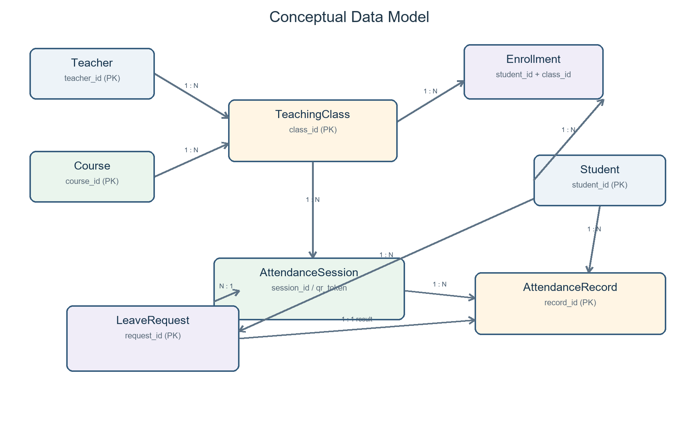
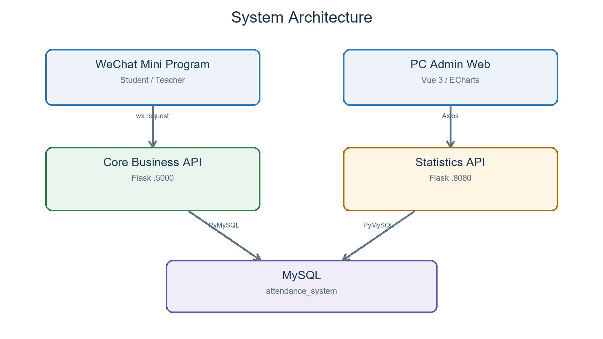

# 课堂扫码签到与请假管理系统期末项目报告

## 摘要

本项目是在期中版本基础上继续完成的课堂考勤系统。期中时主要完成了数据库表和基础查询，期末阶段补齐了教师创建签到、学生扫码、定位与时间校验、结束场次后补录缺勤等流程，并增加了学生请假和教师审批。请假批准后，请假申请与考勤记录会在同一事务中更新，避免同一场次同时出现缺勤和请假两种结果。

系统由微信小程序、PC 管理端、两个 Flask 服务和 MySQL 数据库组成。小程序用于学生签到、请假以及教师发起签到和审批；PC 端用于基础数据维护和统计查询。实现过程中重点处理了重复签到、非选课学生签到、定位越界、重复请假和统计口径不一致等问题。

**关键词：** 课堂考勤；微信小程序；MySQL；Flask；二维码；请假审批

## 1 项目概述

### 1.1 项目背景

课堂点名本身并不复杂，但纸质签到或口头点名很难继续用于后续统计。二维码能缩短点名时间，却不能直接解决二维码转发、重复签到、非本班学生签到以及请假后仍被计为缺勤等问题。我们因此把签到、选课关系、请假审批和统计放在同一套数据库中处理，让每次状态变化都有记录可查。

### 1.2 项目目标

- 建立教师、课程、教学班、学生、选课、签到场次、考勤记录和请假申请之间的关系。
- 跑通教师创建场次、学生扫码、教师结束场次和系统补录缺勤的流程。
- 用事务、行锁和唯一约束处理重复请求及状态冲突。
- 支持学生请假、教师审批，以及缺勤记录转为请假记录。
- 提供学生、教学班、课程、院系和教师等常用统计查询。

### 1.3 实现范围

当前版本用于课程设计和本地部署。登录信息保存在小程序本地缓存中，没有接入学校统一身份认证；真机调试时需要把接口地址改为电脑的局域网 IP。请假目前只填写文字原因和审批备注，不上传证明附件，也没有消息通知。

### 1.4 期中后的改动

1. 补齐创建签到、二维码生成、扫码、时间和定位校验以及缺勤补录。
2. 增加教师课程加载、历史场次、二维码保存和签到记录查询。
3. 将统计查询单独放在 8080 端口的 Flask 服务中。
4. 完成 PC 管理端的学生、教学班、考勤记录和统计页面。
5. 增加请假申请、教师审批和请假状态参与统计的处理。

## 2 系统需求分析

### 2.1 用户角色

| 角色 | 核心目标 | 主要操作 |
| --- | --- | --- |
| 学生 | 快速完成签到并查询个人考勤 | 登录、扫码、定位授权、查看历史、提交请假、查看审批结果、查看个人统计 |
| 教师 | 管理本人教学班的考勤 | 查看教学班、创建场次、生成二维码、结束签到、查看历史、审批请假、查看班级统计 |
| 管理员 | 维护基础数据并分析考勤 | 学生 CRUD、教学班 CRUD、考勤查询与修正、CSV 导入导出、统计看板与异常预警 |

### 2.2 功能性需求

#### 2.2.1 登录与身份保存

小程序提供学生和教师两种身份入口。用户输入学号或工号及姓名后，角色、ID 和姓名保存到本地缓存。不同角色登录后展示不同首页操作和历史入口。

#### 2.2.2 教师创建签到

教师选择本人负责的教学班，设置有效时长、位置校验开关和允许签到半径。后端校验教学班后创建 `attendance_session`，生成全局唯一 `qr_token` 并返回二维码内容。

#### 2.2.3 学生扫码签到

学生扫描二维码并上传当前位置。后端按固定顺序校验二维码、场次状态、学生、选课关系、已有有效记录、时间和位置。系统保留无效尝试作为审计记录，成功记录可为正常或迟到。

#### 2.2.4 结束场次与缺勤补录

教师在签到结束时间后关闭场次。系统查询该教学班所有在选学生，对没有有效考勤记录的学生写入 `absent` 记录，并将场次状态改为 `closed`。

#### 2.2.5 请假申请与审批

学生只能对本人已选教学班的具体签到场次提交请假。已正常签到、迟到或已有批准请假的场次不能再次申请。同一学生同一场次只保留一条申请；驳回后可修改原因重新提交。教师只能审批本人教学班的申请。批准后系统生成 `leave` 考勤记录；如果场次已经结束并存在缺勤记录，则将缺勤记录更新为请假。

#### 2.2.6 数据管理与统计

管理员可以查询和修正考勤记录，维护学生和教学班，导入或导出 CSV。统计服务提供个人、班级、院系、教师、课程对比、每日趋势、连续缺勤、无效签到和未签到名单等数据。

### 2.3 非功能性需求

| 类别 | 要求 | 实现方式 |
| --- | --- | --- |
| 一致性 | 重复请求不能生成多条有效签到 | 数据库事务、`SELECT FOR UPDATE`、有效记录检查 |
| 正确性 | 未选课学生不能签到或请假 | `enrollment` 关系校验 |
| 可追溯性 | 无效签到和审批过程可查询 | 保留无效记录、申请状态、审批人和时间 |
| 可维护性 | 核心业务与统计查询职责分离 | 5000 与 8080 两个 Flask 服务 |
| 易用性 | 教师和学生操作路径短 | 角色化首页、二维码、历史记录与刷新入口 |
| 可部署性 | 能在普通 Windows 环境完成安装 | SQL 脚本、Python 依赖说明、微信开发者工具项目配置 |

### 2.4 核心业务规则

1. 只有 `enroll_status='enrolled'` 的学生才能参与对应教学班考勤。
2. 场次状态为 `ongoing` 时二维码才可用于签到。
3. 正常时段内签到记为 `present`；正常时段后、结束时间前记为 `late`；提前、超时或定位失败记为 `invalid`。
4. 已有有效签到或批准请假的学生不能重复签到。
5. 关闭场次时，只为没有任何有效考勤记录的在选学生补录缺勤。
6. 批准请假不计为出勤，也不计为缺勤，并从统计应到分母中排除。
7. 教师只能查看和审批本人教学班的请假申请。

## 3 数据库概念模型设计

### 3.1 核心实体

| 实体 | 含义 | 关键标识 |
| --- | --- | --- |
| Student | 学生基本信息 | `student_id` |
| Teacher | 教师基本信息 | `teacher_id` |
| Course | 课程信息 | `course_id` |
| TeachingClass | 某教师在某学期开设的教学班 | `class_id` |
| Enrollment | 学生与教学班的选课关系 | `enrollment_id`、学生与教学班唯一组合 |
| AttendanceSession | 一次具体签到活动 | `session_id`、`qr_token` |
| AttendanceRecord | 学生在某场次的考勤结果 | `record_id` |
| LeaveRequest | 学生针对某场次的请假申请 | `request_id`、学生与场次唯一组合 |

### 3.2 实体关系

- 一名教师可以负责多个教学班，一个教学班对应一名教师。
- 一门课程可以开设多个教学班，一个教学班对应一门课程。
- 学生与教学班是多对多关系，通过选课记录连接。
- 一个教学班可以创建多个签到场次。
- 一个签到场次对应多条学生考勤记录。
- 一个学生可以产生多条考勤记录和多条请假申请。
- 一条请假申请必须关联一个学生、一个签到场次和一个教学班，可关联一名审批教师。



## 4 数据库设计

### 4.1 关系模式

```text
TEACHER(teacher_id, name, department)
COURSE(course_id, course_name, department, credit)
STUDENT(student_id, name, gender, department, major, class_name)
TEACHING_CLASS(class_id, semester, location, max_students, teacher_id, course_id)
ENROLLMENT(enrollment_id, student_id, class_id, enroll_date, enroll_status)
ATTENDANCE_SESSION(session_id, class_id, session_date, start_time, end_time,
                   qr_token, valid_minutes, latitude, longitude, radius, status)
ATTENDANCE_RECORD(record_id, session_id, student_id, scan_time,
                  attendance_status, latitude, longitude, is_valid, remark)
LEAVE_REQUEST(request_id, student_id, session_id, class_id, reason, status,
              submit_time, review_time, reviewer_id, review_remark)
```

### 4.2 表结构说明

#### 4.2.1 教师表 teacher

| 字段 | 类型 | 约束 | 说明 |
| --- | --- | --- | --- |
| teacher_id | VARCHAR(20) | 主键 | 教师工号 |
| name | VARCHAR(50) | 非空 | 教师姓名 |
| department | VARCHAR(50) | 非空 | 所属院系 |

#### 4.2.2 课程表 course

| 字段 | 类型 | 约束 | 说明 |
| --- | --- | --- | --- |
| course_id | VARCHAR(20) | 主键 | 课程编号 |
| course_name | VARCHAR(100) | 非空 | 课程名称 |
| department | VARCHAR(50) | 非空 | 开课院系 |
| credit | INT | 非空 | 课程学分 |

#### 4.2.3 学生表 student

| 字段 | 类型 | 约束 | 说明 |
| --- | --- | --- | --- |
| student_id | VARCHAR(20) | 主键 | 学号 |
| name | VARCHAR(50) | 非空 | 姓名 |
| gender | VARCHAR(10) | 可空 | 性别 |
| department | VARCHAR(50) | 非空 | 所属院系 |
| major | VARCHAR(50) | 非空 | 专业 |
| class_name | VARCHAR(50) | 非空 | 行政班 |

#### 4.2.4 教学班表 teaching_class

| 字段 | 类型 | 约束 | 说明 |
| --- | --- | --- | --- |
| class_id | VARCHAR(20) | 主键 | 教学班编号 |
| semester | VARCHAR(20) | 非空 | 学期 |
| location | VARCHAR(100) | 非空 | 上课地点 |
| max_students | INT | 非空 | 最大人数 |
| teacher_id | VARCHAR(20) | 外键 | 授课教师 |
| course_id | VARCHAR(20) | 外键 | 所属课程 |

#### 4.2.5 选课表 enrollment

| 字段 | 类型 | 约束 | 说明 |
| --- | --- | --- | --- |
| enrollment_id | INT | 主键、自增 | 选课记录编号 |
| student_id | VARCHAR(20) | 外键、非空 | 学号 |
| class_id | VARCHAR(20) | 外键、非空 | 教学班编号 |
| enroll_date | DATE | 非空 | 选课日期 |
| enroll_status | VARCHAR(20) | 非空 | `enrolled` 或 `dropped` |

学生与教学班建立唯一组合约束，避免同一学生重复选修同一教学班。

#### 4.2.6 签到场次表 attendance_session

| 字段 | 类型 | 约束 | 说明 |
| --- | --- | --- | --- |
| session_id | INT | 主键、自增 | 场次编号 |
| class_id | VARCHAR(20) | 外键、非空 | 所属教学班 |
| session_date | DATE | 非空 | 签到日期 |
| start_time / end_time | DATETIME | 非空 | 开始与结束时间 |
| qr_token | VARCHAR(64) | 唯一、非空 | 二维码令牌 |
| valid_minutes | INT | 非空 | 正常签到分钟数 |
| location_latitude / longitude | DECIMAL(10,7) | 非空 | 教师基准位置 |
| location_radius | INT | 非空 | 允许距离，单位米 |
| session_status | VARCHAR(20) | 非空 | `ongoing` 或 `closed` |

#### 4.2.7 考勤记录表 attendance_record

| 字段 | 类型 | 约束 | 说明 |
| --- | --- | --- | --- |
| record_id | INT | 主键、自增 | 考勤记录编号 |
| session_id | INT | 外键、非空 | 签到场次 |
| student_id | VARCHAR(20) | 外键、非空 | 学生 |
| scan_time | DATETIME | 非空 | 扫码或系统写入时间 |
| attendance_status | VARCHAR(20) | 非空 | `present/late/absent/invalid/leave` |
| latitude / longitude | DECIMAL(10,7) | 非空 | 学生提交位置 |
| is_valid | VARCHAR(10) | 非空 | `valid` 或 `invalid` |
| remark | VARCHAR(255) | 可空 | 失败原因、迟到或审批说明 |

#### 4.2.8 请假申请表 leave_request

| 字段 | 类型 | 约束 | 说明 |
| --- | --- | --- | --- |
| request_id | INT | 主键、自增 | 申请编号 |
| student_id | VARCHAR(20) | 外键、非空 | 申请学生 |
| session_id | INT | 外键、非空 | 对应场次 |
| class_id | VARCHAR(20) | 外键、非空 | 对应教学班 |
| reason | VARCHAR(500) | 非空 | 请假原因 |
| status | VARCHAR(20) | 非空 | `pending/approved/rejected` |
| submit_time | DATETIME | 非空 | 提交时间 |
| review_time | DATETIME | 可空 | 审批时间 |
| reviewer_id | VARCHAR(20) | 外键、可空 | 审批教师 |
| review_remark | VARCHAR(255) | 可空 | 审批备注 |

学生与场次建立唯一组合约束，防止重复申请；`class_id + status + submit_time` 和 `student_id + submit_time` 建立索引，分别服务教师待审批列表和学生历史查询。

### 4.3 状态字典

| 字段 | 值 | 业务含义 |
| --- | --- | --- |
| attendance_status | present | 正常签到 |
| attendance_status | late | 迟到但有效 |
| attendance_status | absent | 未签到，系统补录缺勤 |
| attendance_status | invalid | 提前、超时、越界等无效尝试 |
| attendance_status | leave | 教师已批准请假 |
| is_valid | valid / invalid | 是否为有效考勤结果 |
| session_status | ongoing / closed | 场次是否开放 |
| enroll_status | enrolled / dropped | 学生是否在选 |
| leave_request.status | pending / approved / rejected | 请假审批状态 |

### 4.4 统计口径

学生出勤率定义为：

```text
出勤率 = (正常次数 + 迟到次数) / (总场次数 - 已批准请假次数) × 100%
```

班级应到人次定义为：

```text
应到人次 = 在选学生数 × 签到场次数 - 已批准请假人次
```

无效扫码保留用于审计，但同一场次存在多个尝试时，统计只选取最终有效状态，优先级为：请假、正常、迟到、缺勤、无效。

## 5 功能设计

### 5.1 教师签到流程

1. 教师登录，小程序读取教师工号。
2. 调用 `/api/teacher/<id>/classes` 加载本人教学班。
3. 教师设置有效时长和位置参数。
4. 调用 `POST /api/sessions` 创建场次。
5. 前端使用 `qrcode.js` 将 `qr_token` 绘制到 Canvas。
6. 教师可保存二维码、查看历史场次并在结束时间后关闭场次。

### 5.2 学生签到流程

1. 学生扫描二维码并获取 GCJ-02 坐标。
2. 前端先通过令牌查询场次，再提交学号和位置。
3. 后端在事务中锁定场次，校验学生与选课关系。
4. 判断重复签到、时间状态和地理距离。
5. 写入考勤记录并返回状态、距离和时间。
6. 学生端刷新签到历史和个人统计。

### 5.3 请假流程

1. 学生加载本人可请假场次并填写原因。
2. 后端校验场次、选课关系和已有有效考勤。
3. 新申请写入 `pending`；驳回后的旧记录可重置为 `pending`。
4. 教师加载本人教学班的申请并批准或驳回。
5. 批准时校验教师归属和学生是否已经签到。
6. 更新申请状态，并插入或更新 `leave` 考勤记录。
7. 统计服务将批准请假从应到分母中排除。

### 5.4 管理端功能

- 学生管理：新增、编辑、删除、CSV 导入和导出。
- 教学班管理：新增、编辑、删除和列表查询。
- 考勤管理：按学号及状态筛选、状态修正、备注修改和 CSV 导出。
- 数据分析：综合看板、个人查询、班级趋势、教师汇总、时间趋势及异常预警。

### 5.5 统计功能

| 维度 | 输出内容 |
| --- | --- |
| 学生 | 总场次、正常、迟到、缺勤、请假、出勤率、明细 |
| 教学班 | 选课人数、场次数、应到人次、有效出勤、缺勤、请假、趋势 |
| 课程 | 同一课程下不同教学班出勤率对比 |
| 院系 | 学生人数与平均出勤率 |
| 教师 | 所带教学班数量、平均出勤率及班级列表 |
| 时间 | 按日期汇总有效出勤和应到人次 |
| 预警 | 缺勤次数较多、无效签到较多、场次未签到名单 |

## 6 模块划分与系统架构



### 6.1 模块职责

| 模块 | 目录或文件 | 职责 |
| --- | --- | --- |
| 微信小程序 | `pages/`、`app.*`、`utils/` | 登录、签到、教师管理、请假、历史和移动统计 |
| 核心业务服务 | `code/app.py`、`code/leave_api.py`、`code/management_api.py` | 场次、签到、缺勤补录、请假、教师与课程管理、教学班名单管理、CRUD 和事务 |
| 统计服务 | `code/query.py` | 聚合查询、趋势、教师汇总和异常预警 |
| PC 管理端 | `admin_web/index.html` | 基础数据维护、考勤修正和 ECharts 看板 |
| 数据库 | `attendance_system.sql` | 表、外键、唯一约束和索引 |

### 6.2 数据流

小程序通过 `wx.request` 调用 5000 端口的核心业务接口和 8080 端口的统计接口。PC 管理端通过 Axios 调用相同服务。`leave_api.py` 与 `management_api.py` 均由 `app.py` 以 Blueprint 方式注册，不需要单独启动。两个 Flask 服务共享 `db.py` 中的 MySQL 连接配置，所有数据最终进入 `attendance_system` 数据库。

## 7 系统实现

### 7.1 技术选型

| 层次 | 技术 | 选择原因 |
| --- | --- | --- |
| 移动端 | 微信小程序原生 WXML/WXSS/JavaScript | 扫码、定位和本地缓存能力完善 |
| PC 前端 | Vue 3、Element Plus、Axios、ECharts | 单文件页面即可快速完成管理和可视化 |
| 后端 | Python、Flask、Flask-CORS | 轻量、接口开发快、适合课程项目 |
| 数据库 | MySQL、PyMySQL | 支持事务、行锁、外键、索引和聚合 SQL |
| 二维码 | 项目内 `qrcode.js` | 小程序端离线生成二维码，无需外部服务 |

### 7.2 核心签到事务

签到接口使用显式事务。后端先以 `qr_token` 查询并锁定签到场次，再校验学生和选课记录；随后查询该学生在该场次是否已有有效记录，并使用 `FOR UPDATE` 防止并发请求同时通过。任一校验失败时回滚事务，成功时写入记录后提交。

### 7.3 时间与定位判定

时间状态由 `judge_time_status` 统一判断。定位距离使用 Haversine 公式：

```text
a = sin²(Δφ/2) + cos φ1 × cos φ2 × sin²(Δλ/2)
d = 2R × asin(√a)
```

其中 `R=6,371,000m`。若教师关闭定位校验，场次坐标写为 `(0,0)`，后端直接放行定位检查；否则距离必须小于等于 `location_radius`。

### 7.4 缺勤补录

结束场次时，后端从在选学生中筛选不存在 `is_valid='valid'` 记录的学生，并逐条写入 `absent + invalid` 记录。批准请假记录使用 `leave + valid`，因此可以自然阻止系统再次补录缺勤。

### 7.5 请假审批一致性

请假审批使用事务并锁定申请记录。系统先核对教学班教师，再检查学生是否已有正常或迟到记录。批准时优先更新已有缺勤记录；不存在缺勤时插入请假记录。申请状态与考勤结果在同一事务中提交，异常时整体回滚。

### 7.6 统计实现

统计服务以 SQL 聚合为主。学生统计使用场次去重，班级统计以“在选学生数 × 场次数”计算理论应到，再扣除批准请假。趋势接口按日期或场次分组；异常预警通过 `GROUP BY`、`HAVING` 和排序筛选缺勤或无效签到较多的学生。

### 7.7 前端实现

小程序通过本地 Storage 保存角色、ID 和姓名。教师端使用 Canvas 2D 绘制二维码，学生端通过 `wx.scanCode` 和 `wx.getLocation` 完成签到。请假页面采用场次选择器、原因输入和状态列表；教师端采用申请卡片和审批弹窗。PC 端使用 Vue 响应式数据管理表格与图表。

## 8 接口设计

### 8.1 核心业务接口

| 方法 | 路径 | 功能 |
| --- | --- | --- |
| POST | `/api/sessions` | 创建签到场次 |
| POST | `/api/sign_in` | 学生扫码签到 |
| POST | `/api/sessions/<id>/finalize` | 关闭场次并补录缺勤 |
| PATCH | `/api/records/<id>` | 修正考勤状态和备注 |
| GET | `/api/sessions/by_token/<token>` | 通过二维码查询场次 |
| GET | `/api/sessions/<id>/records` | 查询场次考勤记录 |
| GET | `/api/students/<id>/records` | 查询学生考勤历史 |
| GET/POST | `/api/students` | 查询或新增学生 |
| PUT/DELETE | `/api/students/<id>` | 编辑或删除学生 |
| POST/GET | `/api/students/import`、`/export` | CSV 导入与导出 |
| GET | `/api/teacher/<id>/classes` | 查询教师教学班 |
| GET | `/api/teacher/<id>/sessions` | 查询教师签到场次 |
| GET/POST | `/api/teaching_classes` | 教学班查询或新增 |
| PUT/DELETE | `/api/teaching_classes/<id>` | 编辑或删除教学班 |

### 8.2 请假接口

| 方法 | 路径 | 功能 |
| --- | --- | --- |
| GET | `/api/students/<id>/leave_options` | 查询可申请请假的场次 |
| GET | `/api/students/<id>/leave_requests` | 查询学生请假历史 |
| POST | `/api/leave_requests` | 提交或重新提交申请 |
| GET | `/api/teacher/<id>/leave_requests` | 查询教师名下申请 |
| POST | `/api/leave_requests/<id>/review` | 批准或驳回申请 |

### 8.3 统计接口

| 路径 | 主要用途 |
| --- | --- |
| `/api/statistics/student/<id>` | 学生汇总 |
| `/api/statistics/student/<id>/records` | 学生明细 |
| `/api/statistics/class/<id>/overview` | 教学班概览 |
| `/api/statistics/class/<id>/trend` | 教学班趋势 |
| `/api/statistics/class/<id>/absent_students` | 缺勤学生 |
| `/api/statistics/course/<id>/classes` | 课程教学班对比 |
| `/api/statistics/department` | 院系统计 |
| `/api/statistics/teacher/<id>/summary` | 教师汇总 |
| `/api/statistics/trend/daily` | 每日趋势 |
| `/api/statistics/warning/continuous_absent` | 连续缺勤预警 |
| `/api/statistics/warning/invalid_signin` | 无效签到统计 |
| `/api/statistics/session/<id>/absent_list` | 场次未签到名单 |

核心业务接口统一返回 `{code, message, data}`，统计接口统一返回 `{code, msg, data}`。前端根据 `code` 判断业务成功或失败。

## 9 系统测试

### 9.1 测试环境

| 项目 | 环境 |
| --- | --- |
| 操作系统 | Windows 10/11 |
| 数据库 | MySQL 8.x |
| Python | Python 3.9 及以上 |
| 后端依赖 | Flask、Flask-CORS、PyMySQL |
| 小程序 | 微信开发者工具稳定版 |
| 浏览器 | Chrome 或 Edge |

### 9.2 功能测试用例

| 编号 | 场景 | 操作或输入 | 预期结果 |
| --- | --- | --- | --- |
| T01 | 教师创建场次 | 合法教学班和时间参数 | 返回场次 ID 和唯一二维码令牌 |
| T02 | 正常签到 | 在正常时段、合法位置扫码 | 写入 `present + valid` |
| T03 | 迟到签到 | 超过正常时长但未到结束时间 | 写入 `late + valid` |
| T04 | 提前扫码 | 开始时间前扫码 | 写入或返回 `invalid` 原因 |
| T05 | 定位越界 | 距离超过允许半径 | 写入 `invalid` 并记录距离 |
| T06 | 未选课签到 | 非本班学生扫码 | 拒绝签到 |
| T07 | 重复签到 | 同一学生重复提交 | 拒绝第二次有效签到 |
| T08 | 结束场次 | 结束时间后关闭 | 场次关闭，未签到学生补录缺勤 |
| T09 | 提交请假 | 在选学生选择可申请场次 | 生成 `pending` 申请 |
| T10 | 重复请假 | 同一场次再次申请 | 阻止待审批或已批准的重复申请 |
| T11 | 驳回后重提 | 修改原因再次提交 | 原申请重置为 `pending` |
| T12 | 教师批准 | 本班教师批准待审批申请 | 申请变 `approved`，生成 `leave` 记录 |
| T13 | 无权审批 | 非本班教师审批 | 返回 403 业务错误 |
| T14 | 缺勤转请假 | 场次结束后批准请假 | 原 `absent` 更新为 `leave` |
| T15 | 请假统计 | 查询学生与班级统计 | 请假不计缺勤且不进入应到分母 |
| T16 | 管理员修正 | 修改状态和备注 | 记录更新并可重新查询 |

### 9.3 已完成的检查

- Python 文件已通过语法检查。
- 学生端、教师端和统计页 JavaScript 已通过 Node `--check`。
- Flask 核心应用共注册 37 条路由，没有发现重复端点。
- 使用本机 MySQL 做过只读联调，教师、课程、场次、教学班和班级名单接口能够返回数据。
- `leave_api.py` 和 `management_api.py` 都能由 `app.py` 正常注册。

### 9.4 测试结论

目前的测试覆盖了本次汇报需要使用的签到、请假、名单管理和统计查询。尚未做并发压力测试，也没有接入真实学校账号，因此本报告只把它作为可在本地运行的课程项目，不把它描述为可直接投入学校使用的系统。

## 10 安装与部署说明

### 10.1 软件要求

- MySQL 8.x 与 MySQL Workbench。
- Python 3.9 及以上。
- 微信开发者工具。
- 可选：VS Code 与 Live Server 插件，用于打开 PC 管理端。

### 10.2 初始化数据库

全新环境先在 MySQL Workbench 中执行：

```sql
SOURCE attendance_system.sql;
```

该脚本会创建 `attendance_system` 数据库及项目所需的表、外键和索引。需要项目自带的测试数据时，再执行：

```sql
SOURCE demo_data.sql;
```

旧版本数据库如果只补充请假功能，可执行 `leave_feature.sql`。

### 10.3 配置数据库连接

`code/db.py` 从环境变量 `MYSQL_PASSWORD` 读取 MySQL 密码。启动每个 Flask 服务前，在对应 PowerShell 窗口执行：

```powershell
$env:MYSQL_PASSWORD = Read-Host "请输入 MySQL 密码"
```

数据库名称默认为 `attendance_system`，主机和端口默认为 `localhost:3306`。

### 10.4 安装依赖并启动后端

```powershell
cd code
python -m pip install flask flask-cors pymysql
python app.py
```

另开终端：

```powershell
cd code
python query.py
```

核心业务服务地址为 `http://127.0.0.1:5000`，统计服务地址为 `http://127.0.0.1:8080`。

### 10.5 启动微信小程序

1. 打开微信开发者工具并扫码登录。
2. 选择“导入项目”，目录选择 `D_leave_project`。
3. 在“详情 - 本地设置”中勾选不校验合法域名，仅用于本地调试。
4. 点击“编译”。
5. 模拟器使用当前 `127.0.0.1` 配置；真机调试需将 `utils/config.js` 改为电脑局域网 IP。

### 10.6 启动 PC 管理端

使用 VS Code 的 Live Server 打开 `admin_web/index.html`。页面默认访问 5000 和 8080 端口，并通过 CDN 加载前端库。

## 11 系统使用说明

### 11.1 学生端

1. 选择学生身份并输入数据库中存在的学号。
2. 首页点击“扫一扫签到”，识别教师二维码并允许定位。
3. 在“我的 - 我的签到历史”查看考勤记录。
4. 在请假区域选择场次、填写原因并提交。
5. 刷新申请记录查看待审批、已批准或已驳回状态。
6. 在“出勤统计看板”查看个人及课程统计。

### 11.2 教师端

1. 使用教师工号登录，进入“发起签到”。
2. 选择教学班和有效时长，可设置地理位置半径。
3. 生成二维码并展示给学生。
4. 在请假审批区域查看、批准或驳回申请。
5. 到结束时间后关闭场次，系统自动补录缺勤。
6. 通过历史场次和统计看板查看教学班情况。

### 11.3 管理端

管理员可维护学生和教学班，筛选考勤状态，修改错误记录，导入或导出 CSV，并在统计模块查看院系、个人、班级、教师、趋势和预警数据。


## 12 项目目录与文件说明

| 路径 | 作用 |
| --- | --- |
| `app.js / app.json / app.wxss` | 小程序入口、页面注册、权限与全局样式 |
| `pages/login` | 学生和教师登录 |
| `pages/home` | 角色化首页和学生扫码入口 |
| `pages/student` | 学生签到历史与请假申请 |
| `pages/teacher` | 教师创建签到、二维码、历史与请假审批 |
| `pages/mine` | 个人信息、历史和统计入口 |
| `pages/stats` | 学生或教师统计看板 |
| `utils/config.js` | 5000 和 8080 API 地址 |
| `utils/qrcode.js` | 小程序二维码编码和绘制 |
| `code/app.py` | 核心业务 API |
| `code/leave_api.py` | 请假申请与审批 API，由 `app.py` 注册 |
| `code/management_api.py` | 教师、课程和教学班名单管理 API，由 `app.py` 注册 |
| `code/query.py` | 统计 API |
| `code/db.py` | MySQL 连接配置 |
| `admin_web/index.html` | PC 管理端单页应用 |
| `attendance_system.sql` | 全量数据库建表脚本 |
| `leave_feature.sql` | 旧数据库请假功能迁移脚本 |

## 13 当前限制与后续改进

1. 小程序登录只保存本地身份，后端还没有真正的账号认证和权限令牌。
2. 一个签到场次只生成一个二维码，学生转发二维码后主要依靠时间、选课关系和定位限制，防转发能力仍然有限。
3. 请假只能填写文字原因，暂时没有证明附件、消息提醒和批量审批。
4. PC 管理端从 CDN 加载 Vue、Element Plus 和 ECharts，断网时页面无法完整打开。
5. 目前完成的是功能和接口联调，后续还需要补充自动化测试和多人同时签到的压力测试。

## 14 总结

这次课程设计最终完成了从建表到前后端联调的一整套流程。教师可以创建和结束签到，学生可以扫码、查看记录和提交请假，教师审批后考勤状态会同步变化；管理端可以维护基础数据并查看统计结果。数据库中的外键、唯一约束和事务主要用来解决重复数据以及请假、缺勤状态冲突。项目仍有身份认证和防转发方面的不足，但现有代码已经能够按 README 在本地重新安装并完成主要功能测试。

## 附录 提交清单

- GitHub 仓库：`https://github.com/xxc685/D_leave_project`。
- 项目代码：仓库中的整个 `D_leave_project` 目录。
- 全量数据库脚本：`attendance_system.sql`。
- 旧库迁移脚本：`leave_feature.sql`。
- 项目报告：`output/pdf/课堂扫码签到与请假管理系统-期末项目报告.pdf`。
- 安装、使用和测试说明：仓库根目录的 `README.md`。
